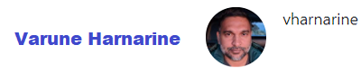

# tkrSearch

tkrSearch pronounced as "Ticker Search" is stock and cryptocurrency search application.
trkSearch searches the ticker and presents the user with company profile and useful information like current price, 52 Week High and Lows etc.

## Application, Repo  and Project dashboard Urls
* Application Url : https://bhagatabhijeet.github.io/tkrsearch/index.html
* GitHub Repo : https://github.com/bhagatabhijeet/tkrsearch
* Project Kanban Board : https://github.com/users/bhagatabhijeet/projects/1
* Wiki : https://github.com/bhagatabhijeet/tkrsearch/wiki

## Application Demo

### Meet the team
|||
| --- | --- |
||https://github.com/bhagatabhijeet (Roles : Scrum master, Project management and Front end developer)|
|https://github.com/bosshogg86 (Roles : Architecture and Back end developer)||
||https://github.com/mkamran67 (Roles : Architecture and Back end developer)|
|https://github.com/vharnarine (Roles : UI designer, Front end developer and lead documentation)||

## Libraries
| Library # | Doc Link | What is it | Source |
| --- | --- | --- | --- |
| Mdbootstrap 4.19.1 | [https://mdbootstrap.com/?utm\_ref\_id=96808](https://mdbootstrap.com/?utm_ref_id=96808) | CSS framework for UI | CDN |
| jQuery | [https://code.jquery.com/](https://code.jquery.com/) | It&#39;s a JavaScript Selector and animation lib | Local File |
| moment.js | [https://momentjs.com/](https://momentjs.com/) | Time manipulation lib. Eases the date time handling | Local file |
| Tabulator | [http://tabulator.info/docs/4.7/jquery](http://tabulator.info/docs/4.7/jquery) | Tabulator allows you to create interactive tables in seconds from any HTML Table, JavaScript Array, AJAX data source or JSON formatted data. | CDN |

## API Courtesy
* https://min-api.cryptocompare.com
* https://cloud.iexapis.com

# Future Plans:
* make last 10 search persistent
* Add Graphs
* more UI features like get historical data and graphs.

# License and Code of Conduct
[License](LICENSE.md)
[Code of Conduct](CODE_OF_CONDUCT.md)

# Contributing Guidelines
[Contributing](CONTRIBUTING.md)

