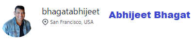

# tkrsearch

tkrSearch pronounced as "Ticker Search" is stock and cryptocurrency  search application.
trkSearch searches the ticker and presents the user with company profile and useful information like current price, 52 Week High and Lows etc.

## Application, Repo  and Project dashboard Urls
* Application Url : https://bhagatabhijeet.github.io/tkrsearch/index.html
* GitHub Repo : https://github.com/bhagatabhijeet/tkrsearch
* Project Kanban Board : https://github.com/users/bhagatabhijeet/projects/1

## Application Demo

## Contributors:
### Meet the team
|||
| --- | --- |
||https://github.com/bhagatabhijeet|
|https://github.com/bosshogg86||
||https://github.com/mkamran67|
|https://github.com/vharnarine||

